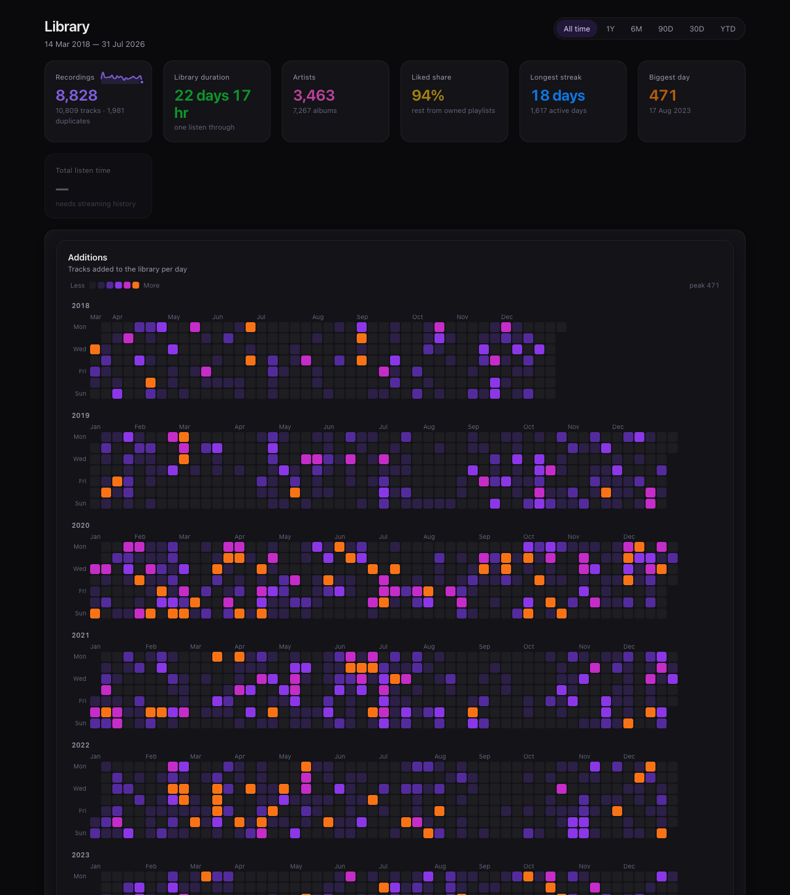
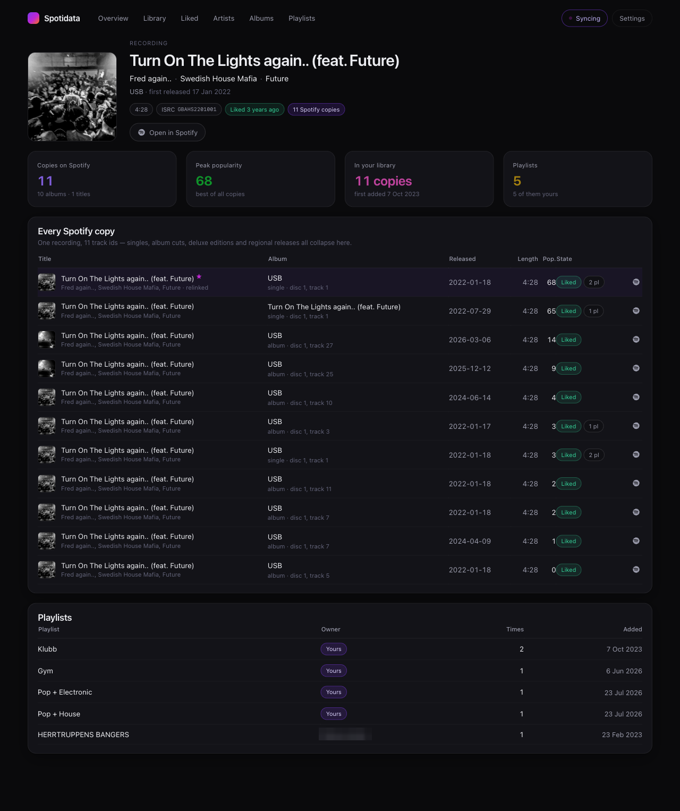
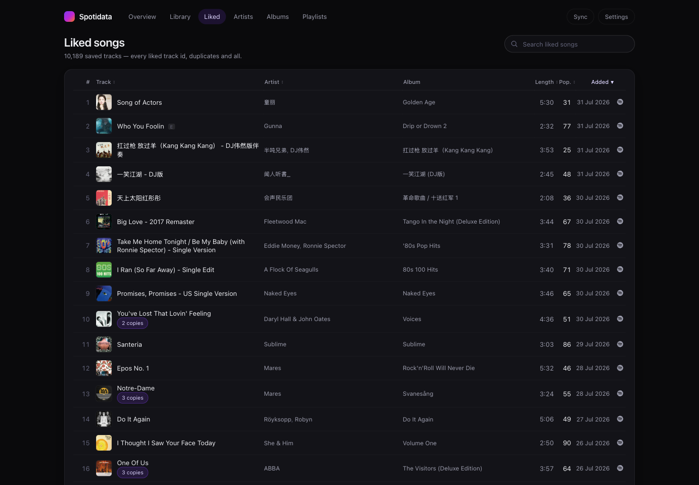
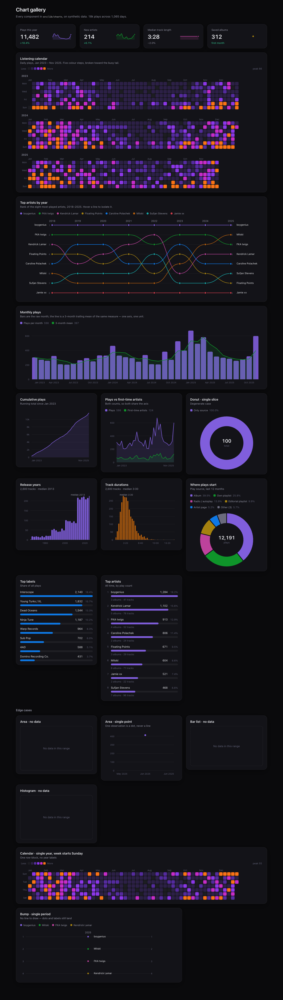

# Spotidata

A single-user monolith that ingests a Spotify account into local Postgres and
presents it as a dark, chart-heavy dashboard, resyncing in the background.

Bun · TypeScript · SvelteKit 2 (Svelte 5 runes) · Postgres 18 · Drizzle v1 ·
Graphile Worker · d3 v7.



*Top of the dashboard — [see the whole page](docs/screenshots/dashboard.png), sixteen
charts over a 8.8k-recording library.*

## Why local ingest

The Spotify API is shrinking — audio-features, recommendations and
related-artists are gone (403/404), editorial playlists are unreachable, and
`preview_url` is permanently null. It is also rate-limited to roughly 3 req/s
with no published number. Track metadata barely changes, so the design pulls
everything once and keeps it.

## Quick start

```bash
cp .env.example .env          # fill in SPOTIFY_CLIENT_ID / SECRET
bun install
bun run db:up                 # postgres:18-trixie via docker compose
bun run db:migrate            # extensions → drizzle migrations → SQL functions → seed
bun run dev                   # http://127.0.0.1:5173
```

Then open `/auth/login` and approve. Trigger the first sync from `/sync`.

**Redirect URIs** must be registered on the Spotify app exactly as:

```
http://127.0.0.1:5173/auth/callback     (dev)
http://127.0.0.1:4173/auth/callback     (preview)
```

Spotify rejects `localhost`; the loopback IP literal is the only non-HTTPS
exception.

## Scripts

| Command | Purpose |
|---|---|
| `bun run verify` | tsc + migration guard + SQL convention lint |
| `bun run probe` | Live API contract test (13 endpoints) |
| `bun run db:reset` | Backs up the OAuth grant, recreates the DB, restores it |
| `bun run db:backup -- --full` | `pg_dump` alongside the grant |
| `bun run db:generate` | New migration + guard against touching the queue schema |

## Design decisions worth knowing

**A track is an ISRC.** `canonical_tracks` groups every Spotify track id sharing
a recording — this library has 10,809 library tracks across 8,828 recordings.
The table holds zero user data and is rebuilt idempotently by
`spotidata.refresh_canonical_tracks()`; anything user-authored keys on
`spotify_tracks.id` so a regrouping can never orphan it.



*One recording, eleven track ids — singles, album cuts, deluxe editions and
regional releases all collapse onto the same page.*

**The library** is liked songs ∪ tracks in playlists you own. Other playlists
are ingested in full but excluded from library statistics.



**Bulk endpoints still work**, contrary to widespread claims. `/albums?ids=`
takes 20 ids *and embeds each album's first 50 tracks*, which is why a full
sync of ~70k tracks costs ~2,600 requests rather than ~170,000.

**Incremental sync** uses two levers: playlist `snapshot_id` gating, and the
newest-first `added_at` watermark on `/me/tracks`. A no-change resync makes
**17 requests**. Early stop cannot see removals, so a count mismatch forces a
full pass and cron runs a full reconciliation weekly.

**Rate limiting lives in Postgres** — a token bucket plus a circuit breaker.
In memory it would evaporate on restart, and a `Retry-After` measured in hours
must survive that. A 429 halves the rate; `maintenance:rate-recover` ramps it
back (AIMD). While the breaker is open, Graphile Worker's `forbiddenFlags`
skips every Spotify job wholesale instead of burning retries.

**Analytics are raw SQL, no materialized views.** Every chart is a `GROUP BY`
over `library_canonical` (8.8k rows, resident in shared buffers) — all sixteen
dashboard queries run in ~130 ms total. MVs also cannot be parameterized by an
arbitrary time range, which the range picker requires.

**Charts are d3 for maths, Svelte for DOM** — no `d3-selection`. Every component
in `src/lib/charts` renders at `/_charts` against synthetic data, including the
empty and single-point cases that are easy to get wrong.

<details>
<summary>The chart gallery (click to expand)</summary>



</details>

## Traps this codebase has already hit

Each of these failed silently rather than loudly, so they have guards:

- **Raw SQL returns timestamps as strings.** Drizzle configures node-postgres
  that way and maps them itself only in the query builder. `someDate <= thatString`
  is always false — this disabled the liked-songs early stop for a whole sync.
  `bun run lint:sql` now fails the build on an uncast `max(added_at)`.
- **A JS array interpolated into `sql` becomes a row constructor**, not an
  array. Use the helpers in `src/lib/server/db/arrays.ts`.
- **Circular imports break Graphile Worker job specs.** `constants.ts` imports
  nothing for this reason; a cycle left `SPOTIFY_FLAG` undefined and every job
  was queued with `flags: [null]`.
- **Concurrent upserts deadlock.** `dedupeBy` sorts by key so all transactions
  lock in the same order, and `runLeafTask` retries on SQLSTATE 40P01 without
  re-issuing the HTTP request.
- **drizzle-kit v1 defaults `schemaFilter` to all schemas** and would drop
  `graphile_worker`. Pinned to `public`, with `scripts/check-migration.ts` as a
  build-failing backstop.
- **Timestamptz arithmetic is STABLE, not IMMUTABLE**, so it cannot back a
  generated column. `refresh_expires_at` pins both conversions to UTC.
- **Worker task code does not hot-reload.** Graphile Worker captures `taskList`
  at startup; restart the dev server after editing anything under `queue/tasks`.

## Layout

```
db/migrations/     committed drizzle output
db/sql/pre/        extensions + parse_release_date (migrations depend on them)
db/sql/post/       fallback_key, rate limiter, refresh_canonical, refresh_library
src/lib/server/    db/ spotify/ ingest/ queue/ stats/ entities/
src/lib/charts/    d3 computes, Svelte renders — no d3-selection
src/routes/        dashboard, entity pages, /sync, /settings, /api
scripts/           probe-api, apply-sql, check-migration, check-sql-conventions,
                   backup, restore-auth, spike-worker
```

Nothing under `src/lib/server` may import `$lib`, `$env/*` or `Bun.*`: the same
modules run under Bun (SvelteKit) and plain Node (`bun run worker`), so
`WORKER_MODE=external` is a one-line change.

## Not built yet

Listening history ingestion and the extended-streaming-history import;
MusicBrainz/Beatport enrichment; an MCP SQL endpoint; Telegram re-auth alerts.
The schema reserves space for all of them — `plays` and friends key on
`spotify_tracks.id`, never the canonical id.
